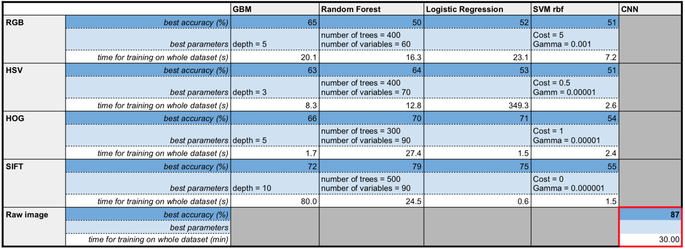

# Spring2018


# Project 2: Predictive Modelling

----


### [Project Description](doc/)


Term: Spring 2018

+ Project title: Predictive Modelling - Dogs or Cats?
+ Team Number: Group 2
+ Team Members: Jerome Kafrouni, Ayano Kase, Joo Kim, Chunzi Wang, Chuyuan Zhou
+ Project summary: In this project, we built an image classification model that distinguishes between pictures of dogs and cats. The process consists of two parts: feature extraction and model training. We adopted SIFT, RGB, HOG, and HSV feature extraction methods to train on classification models GBM, Random Forest, XGBOOST, Logistics Regression, and SVM. In addition, we used Convolutional Neural Networks for feature extraction and classification. After model evaluation and comparison, we find that the optimal model is CNN. However, the trade-off between accuracy and time is an area for further improvement. 
+ Performance Analysis



# As for GBM, the we could see that the best result comes with SIFT feature extraction, and the best parameter is depth = 10. It comes with an accuracy of 72%, which is higher than with other feature extraction methods. The results for other feature extraction methods are around 63%, witch we acheived improvements using other models.


#### Contribution Statement

+ Jerome Kafrouni
+ Ayano Kase
  - Built, trained, and tested SVM (linear and rbf) on all the features
  - Created README.md
  - Contributed to the presentation slide deck
+ Joo Kim
+ Chunzi Wang
+ Chuyuan Zhou
  - Built, trained, and tested GBM on all features 
  - Help Organized and contributed to README.md
  - Contributed to the presentation slide deck


Following [suggestions](http://nicercode.github.io/blog/2013-04-05-projects/) by [RICH FITZJOHN](http://nicercode.github.io/about/#Team) (@richfitz). This folder is orgarnized as follows.

```
proj/
├── lib/
├── data/
├── doc/
├── figs/
└── output/
```

Please see each subfolder for a README file.
