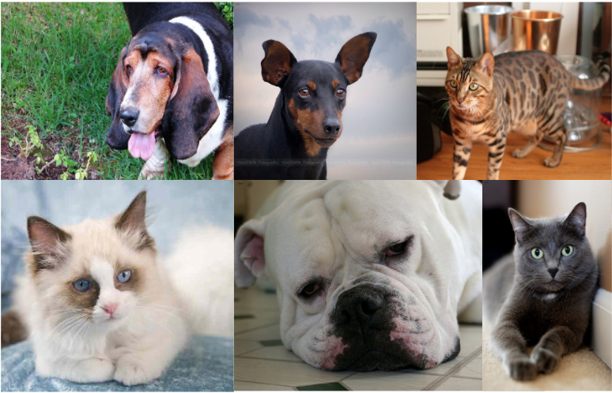
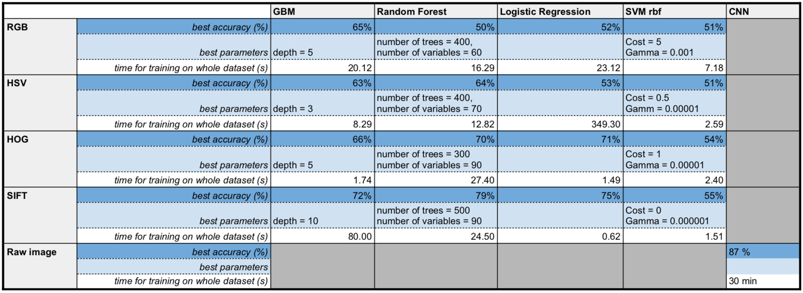

# Spring2018


# Project 2: Predictive Modelling

----


### [Project Description](doc/)



Term: Spring 2018

+ Project title: Predictive Modelling - Dogs or Cats?
+ Team Number: Group 2
+ Team Members: Jerome Kafrouni, Ayano Kase, Joo Kim, Chunzi Wang, Chuyuan Wang
+ Project summary: In this project, we built an image classification model that distinguishes between pictures of dogs and cats. The process consists of two parts: feature extraction and model training. We adopted SIFT, RGB, HOG, and HSV feature extraction methods to train on classification models GBM, Random Forest, XGBOOST, Logistics Regression, and SVM. In addition, we used Convolutional Neural Networks for feature extraction and classification. After model evaluation and comparison, the optimal model is....
+ Performance Analysis



#### Contribution Statement

+ Jerome Kafrouni
+ Ayano Kase
+ Joo Kim
+ Chunzi Wang
+ Chuyuan Wang


Following [suggestions](http://nicercode.github.io/blog/2013-04-05-projects/) by [RICH FITZJOHN](http://nicercode.github.io/about/#Team) (@richfitz). This folder is orgarnized as follows.

```
proj/
├── lib/
├── data/
├── doc/
├── figs/
└── output/
```

Please see each subfolder for a README file.
